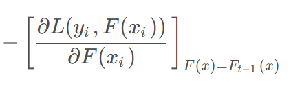
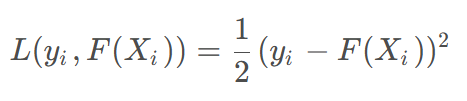
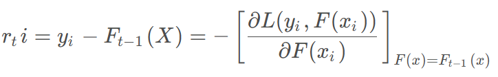

# GBDT

全称：Gradient Boosting Decision Tree，即为梯度提升决策树，理解为：**梯度提升+决策树**。“提升”指的是通过添加一个新的弱学习器迭代改进模型的方法），以此来最小化损失函数。利用损失函数的负梯度拟合基学习器。

平方损失函数，为求导方便，在损失函数前面乘以 1/2 

残差是梯度的相反数，即有:

在 GBDT中就是使用负梯度作为残差进行拟合。

算法详细过程参考：https://blog.csdn.net/blinkyou001/article/details/135580384