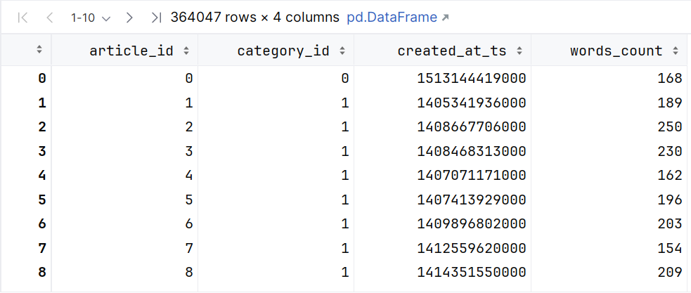
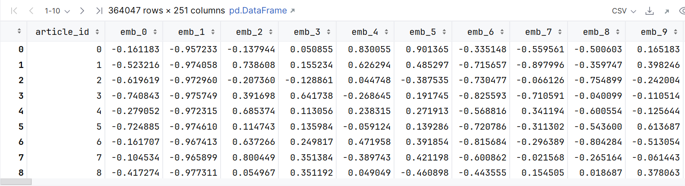
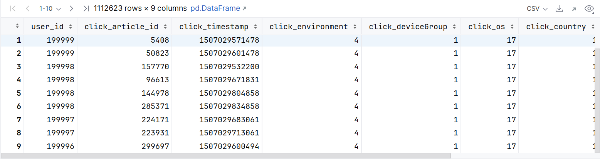
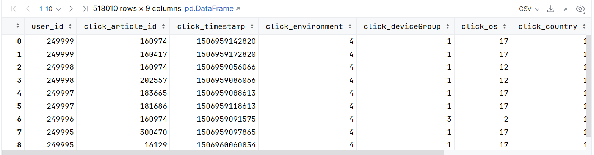
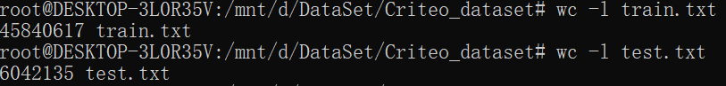
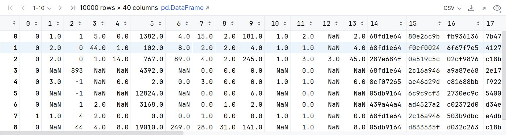
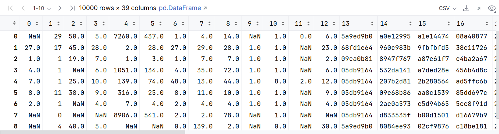
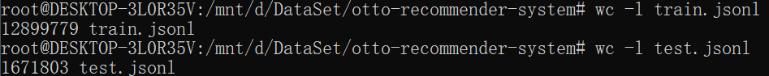

# MovieLens 1M数据集

ml-1m是GroupLens Research从MovieLens网站上收集并提供的电影评分数据集。包含了6000多位用户对近3900个电影的共100万条评分数据，评分均为1～5的整数，其中每个电影的评分数据至少有20条。该数据集包含三个数据文件，分别是：

users.dat，存储用户属性信息的文本格式文件

用户属性信息的格式为：UserID::Gender::Age::Occupation::Zip-code

movies.dat，存储电影属性信息的文本格式文件

电影元数据的格式为：MovieID::Title::Genres

ratings.dat， 存储电影评分信息的文本格式文件

电影评分的格式为：UserID::MovieID::Rating::Timestamp

# 阿里天池 新闻推荐数据集

下载地址：https://tianchi.aliyun.com/competition/entrance/531842/information

`train_click_log.csv`：训练集用户点击日志

`testA_click_log.csv`：测试集用户点击日志

`articles.csv`：新闻文章信息数据表

`articles_emb.csv`：新闻文章embedding向量表示

## articles.csv  



| **Field**     | **Description**                  |
| ------------- | -------------------------------- |
| article_id    | 文章id，与click_article_id相对应 |
| category_id   | 文章类型id                       |
| created_at_ts | 文章创建时间戳                   |
| words_count   | 文章字数                         |

## articles_emb.csv



| **Field**               | **Description**       |
| ----------------------- | --------------------- |
| emb_1,emb_2,...,emb_249 | 文章embedding向量表示 |

## train_click_log.csv



| **Field**           | **Description** |
| ------------------- | --------------- |
| user_id             | 用户id          |
| click_article_id    | 点击文章id      |
| click_timestamp     | 点击时间戳      |
| click_environment   | 点击环境        |
| click_deviceGroup   | 点击设备组      |
| click_os            | 点击操作系统    |
| click_country       | 点击城市        |
| click_region        | 点击地区        |
| click_referrer_type | 点击来源类型    |

## testA_click_log.csv



同上train_click_log.csv


# Criteo Dataset

下载地址：https://www.kaggle.com/datasets/mrkmakr/criteo-dataset?resource=download



## train.txt

训练集包含 **Criteo 7 天内的一部分流量**。 每行对应一个由 Criteo 提供的展示广告。 正（点击）和负（未点击）示例都以不同的比率进行了子采样，以减少数据集大小。 这些示例按时间顺序排列。 有13个特征取整数值（主要是计数特征）和26个分类特征。为了匿名化，分类特征的值已被散列到32位。这些特征的语义尚未公开。某些功能可能缺少值。

Data fields

- Label - Target variable that indicates if an ad was clicked (1) or not (0).（待预测广告，被点击是1，没有被点击是0。）
- I1-I13 - A total of 13 columns of integer features (mostly count features).（总共 13 列数值型特征（主要是计数特征）。）
- C1-C26 - A total of 26 columns of categorical features. The values of these features have been hashed onto 32 bits for anonymization purposes. （共有 26 列类别型特征。 出于匿名目的，这些功能的值已散列到 32 位。）

前10000条数据预览



后26列应为16进制

## test.txt

测试集的计算方式与训练集相同，针对的是训练集后一天的事件



无label


# otto-recommender-system(kaggle竞赛)

下载地址：https://www.kaggle.com/competitions/otto-recommender-system/data

这场比赛的目标是预测电子商务点击、购物车添加和订单。您将基于用户会话中的先前事件构建一个多目标推荐系统。
训练数据包含完整的电子商务会话信息。对于测试数据中的每个会话，您的任务是预测测试会话中最后一个时间戳ts之后出现的每种会话类型的辅助值。换句话说，测试数据包含由时间戳截断的会话，您需要预测截断点后会发生什么。
train.jsonl-包含完整会话数据的训练数据

- session-唯一的会话id
- events-会话中按时间顺序排列的事件序列
  - aid-相关事件的物品id（产品代码）
  - ts-事件的Unix时间戳
  - type-事件类型，即产品是否在会话期间被点击、添加到用户的购物车或订购

grep Demo

```
{"session":8,"events":[{"aid":1814223,"ts":1659304800136,"type":"clicks"},{"aid":324620,"ts":1659304815389,"type":"clicks"},{"aid":1320098,"ts":1659304827550,"type":"clicks"},{"aid":324620,"ts":1659304839975,"type":"clicks"}]}

{"session":9,"events":[{"aid":847707,"ts":1659304800144,"type":"clicks"},{"aid":847707,"ts":1659304857552,"type":"carts"},{"aid":1078113,"ts":1659304889167,"type":"clicks"},{"aid":502913,"ts":1659304898154,"type":"clicks"},{"aid":502913,"ts":1659304936085,"type":"clicks"},{"aid":1369253,"ts":1659381879887,"type":"clicks"},{"aid":641969,"ts":1659648132568,"type":"clicks"}]}
```

test.jsonl-测试数据，其中包含截断的会话数据

grep Demo

```
{"session":12899786,"events":[{"aid":955252,"ts":1661724001174,"type":"clicks"},{"aid":955252,"ts":1661724017764,"type":"carts"}]}

{"session":12899787,"events":[{"aid":1682750,"ts":1661724001617,"type":"clicks"},{"aid":1682750,"ts":1661724025329,"type":"carts"},{"aid":1682750,"ts":1661724029598,"type":"carts"},{"aid":1682750,"ts":1661724042424,"type":"carts"},{"aid":1024433,"ts":1661724195533,"type":"clicks"}]}

{"session":12899788,"events":[{"aid":245131,"ts":1661724001619,"type":"clicks"},{"aid":39846,"ts":1661724018620,"type":"clicks"},{"aid":1259911,"ts":1661724034826,"type":"clicks"},{"aid":1663048,"ts":1661724078816,"type":"clicks"}]}
```

您的任务是预测会话截断后点击的下一个辅助工具，以及添加到购物车和订单中的剩余辅助工具；您可以为每种会话类型预测多达20个值



