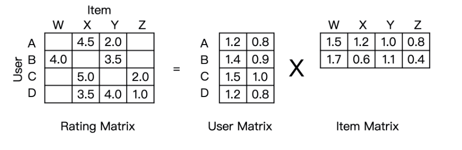
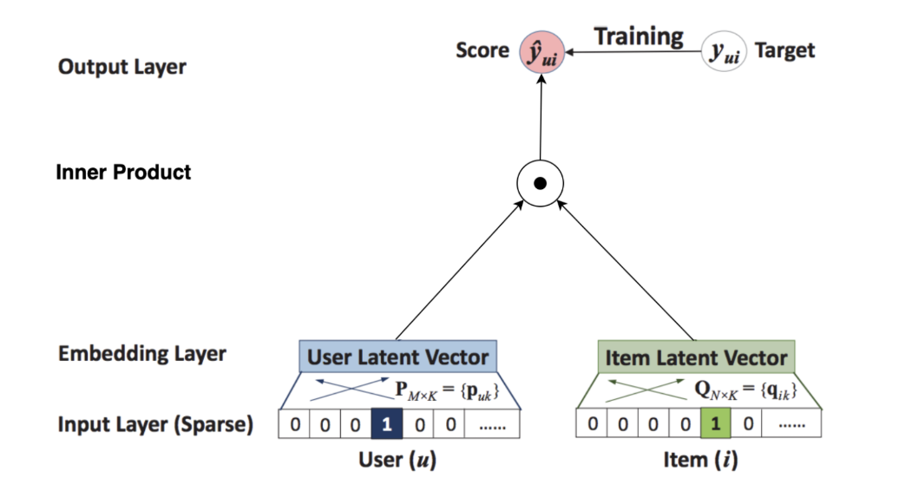
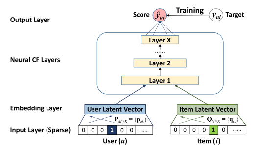
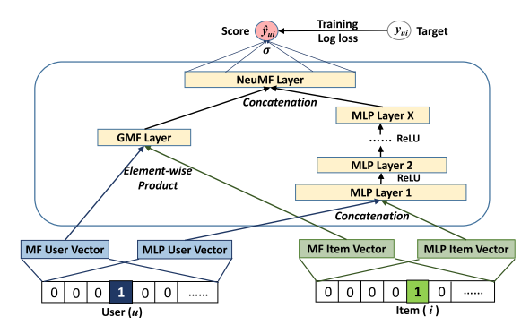

# NeuralCF Model

基于神经网络的技术来解决推荐中的关键问题--基于隐式反馈的协同过滤

协同过滤：利用用户和物品之间的交互行为历史，构建出一个像下图左一样的共现矩阵（一般为交互评分矩阵）。在共现矩阵的基础上，利用每一行的用户向量相似性，找到相似用户，再利用相似用户喜欢的物品进行推荐。



矩阵分解：把协同过滤中的共现矩阵分解成了用户矩阵和物品矩阵（如上图右侧），从用户矩阵中提取出用户隐向量，从物品矩阵中提取出物品隐向量，再利用它们之间的内积相似性进行推荐排序。矩阵分解的神经网路结构图如下，Embedding层将稀疏向量转换为稠密向量，将用户隐向量与物品隐向量内积得到相似度



NeuralCF用多层神经网络+输出层代替内积



优点：1、用户向量与物品向量充分交叉，得到更多组合信息；2、引入更多非线性特征




融合广义矩阵分解模型（GMF）


## 1. **GMF 部分 (Generalized Matrix Factorization)**

**代码逻辑：**

```
gmf_output = self.embed_gmf(x)[:, 0] * self.embed_gmf(x)[:, 1]
```

- 输入
  - 用户和物品的ID `(batch_size, 2)`，通过 `FeaturesEmbedding` 层映射到嵌入空间。
- 过程
  - `self.embed_gmf(x)` 将用户和物品ID嵌入到低维空间，输出形状为 `(batch_size, 2, embed_dim)`。
  - 取用户和物品的嵌入向量 `[:, 0]` 和 `[:, 1]`，形状分别为 `(batch_size, embed_dim)`。
  - 通过逐元素相乘计算用户与物品的交互信息，得到 `gmf_output`，形状为 `(batch_size, embed_dim)`。
- **输出**: `(batch_size, embed_dim)`，表示用户和物品在GMF空间的交互。

------

## 2. **MLP 部分 (Multi-Layer Perceptron)**

**代码逻辑：**

```
mlp_input = self.embed_mlp(x).reshape(x.size(0), -1)
mlp_output = self.mlp(mlp_input)
```

- 输入
  - 用户和物品ID `(batch_size, 2)`。
- 过程
  - `self.embed_mlp(x)` 将用户和物品ID嵌入到MLP的低维空间，输出形状为 `(batch_size, 2, embed_dim)`。
  - 通过 `.reshape` 将维度展平为 `(batch_size, 2 * embed_dim)`。
  - 输入到 self.mlp 进行多层感知计算，层次如下：
    - 第一层:  Linear(2 * embed_dim, 128) \+ BatchNorm1d(128) \+ ReLU()
      - 输入形状: `(batch_size, 2 * embed_dim)`。
      - 输出形状: `(batch_size, 128)`。
    - 第二层:  Linear(128, 64) \+ BatchNorm1d(64) \+ ReLU()
      - 输入形状: `(batch_size, 128)`。
      - 输出形状: `(batch_size, 64)`。
    - 输出层:  Linear(64, 64)
      - 输入形状: `(batch_size, 64)`。
      - 输出形状: `(batch_size, 64)`。
- **输出**: `(batch_size, 64)`，表示用户和物品的非线性交互表示。

------

## 3. **融合层和预测层**

**代码逻辑：**

```
concated = torch.cat([gmf_output, mlp_output], dim=1)
output = torch.sigmoid(self.fc(concated))
```

- 输入
  - GMF的输出 `(batch_size, embed_dim)` 和 MLP的输出 `(batch_size, 64)`。
- 过程
  - 拼接 GMF 和 MLP 的输出为 `(batch_size, embed_dim + 64)`。
  - 输入到全连接层 `Linear(embed_dim + 64, 1)`，得到未归一化的预测值 `(batch_size, 1)`。
  - 通过 `sigmoid` 函数将值映射到 `[0, 1]` 区间，作为点击的概率。
- **输出**: `(batch_size, 1)`，表示用户点击物品的预测概率。

------

## NeuralCF 模型整体结构

| 模块      | 输入形状                       | 输出形状                  | 主要作用                             |
| --------- | ------------------------------ | ------------------------- | ------------------------------------ |
| GMF嵌入层 | `(batch_size, 2)`              | `(batch_size, embed_dim)` | 生成用户和物品的线性交互表示         |
| MLP嵌入层 | `(batch_size, 2)`              | `(batch_size, 64)`        | 生成用户和物品的非线性交互表示       |
| 融合层    | `(batch_size, embed_dim + 64)` | `(batch_size, 1)`         | 将GMF和MLP结合，生成最终点击概率预测 |