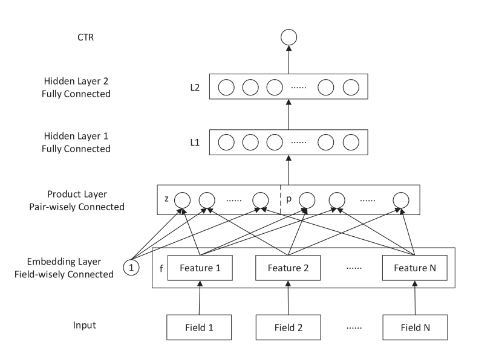

# PNN

Embedding层处理离散特征、增加Product层，在Product Layer中，通过显式构造特征交叉，在不同的特征域之间进行特征组合

## 网络结构

第一层为特征Embedding层，第二层为Product层（PNN最为核心的部分）， 第三层与第四层是传统的全连接网络层，最后模型的输出层。

Product层

向量的内积运算输入为向量对，输出为一个标量。与其不同的是，向量外积操作的输出是得到一个矩阵。

