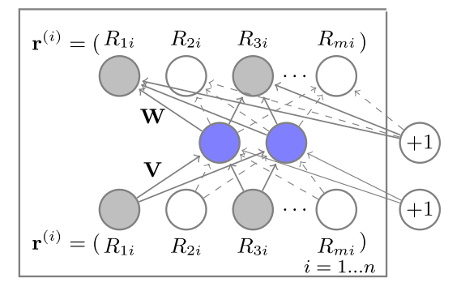

# AutoRec

数据：

用户数：6040

电影数：3952

评分条数：1000209

训练集比例：0.9

```
train_r,train_mask_r,test_r,test_mask_r shape = (6040, 3952) 共现矩阵与邻接矩阵
按总评分条数划分，训练数据占比90%
```

模型输入：

（batchsize, 3952）

模型结构：



编码器 (Encoder)
输入层：接收用户-项目矩阵（即模型输入），维度为 num_items。
隐藏层：通过线性变换将输入层映射到 hidden_units 维度，然后通过 Sigmoid 激活函数进行非线性变换。
解码器 (Decoder)
输出层：通过线性变换将隐藏层的输出映射回 num_items 维度，重构用户-项目矩阵。
