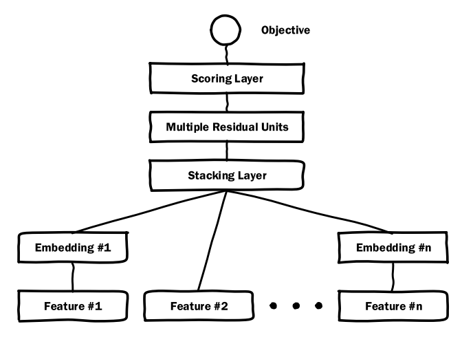
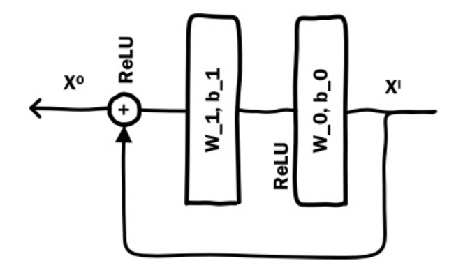

# Deep Crossing

利用残差网络结构挖掘特征间的关系

模型结构：

特征抽取层： 类别型特征、数值型特征等

Embedding：将稀疏的类别特征转化为稠密的Embedding向量

Stacking层：把不同的Embedding特征与数值特征做拼接（concatenate）

Multiple Residual Units Layer （残差神经网络层）：解决过拟合以及梯度消失问题

Scoring层：拟合优化目标存在的，通常使用逻辑回归解决CTR 中的二分类问题，如果是多分类就通过softmax 处理