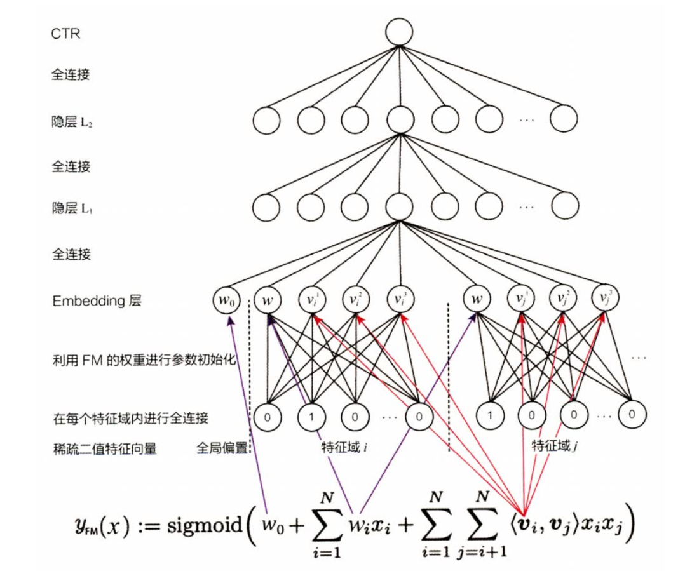

# FNN

Factorisation Machine supported Neural Network

概括FNN：FM+MLP

两阶段训练的模型，阶段一先训练一个FM模型得到每个field的embedding向量，阶段二，基于阶段一的embedding向量初始化MLP的embedding层，然后训练一个MLP（DNN）

优点：在end-to-end训练DNN（MLP）的embedding层向量时，都是随机初始化的。而FNN把FM训练好的embedding向量用于初始化DNN的embedding向量，相当于在初始化DNN的embedding向量时引入了先验知识，因此能够更好更快的收敛DNN。

缺点：1、DNN的embedding层质量受限于FM的训练质量。2、在FM中进行特征交叉时使用的是隐向量点积，把FM预训练得到的embedding向量送入到MLP中的全链接层，MLP的全链接层本质上做的是特征间的线性加权求和，即做的是『add』的操作，这与FM有点不太统一。另外，MLP中忽略了不同的field之间的区别，全部采用线性加权求和。
