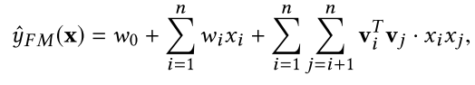
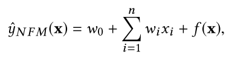
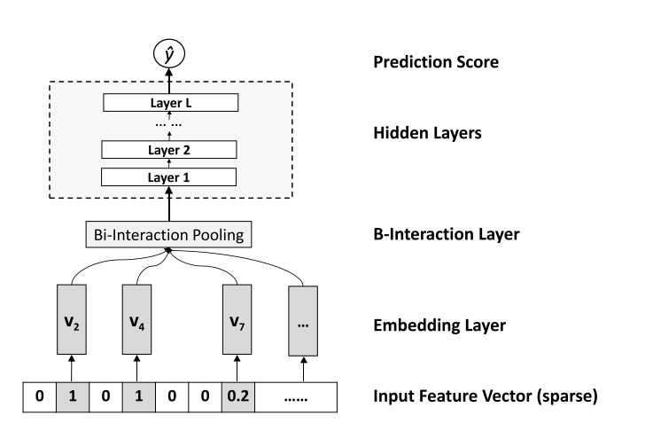
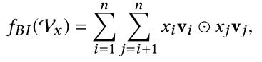

# NFM

因式分解机最初被提出用于协作推荐。给定一个真实的值特征向量x ∈ Rn，FM通过对每对特征之间的所有相互作用进行建模来估计目标：

其中w0是全局偏差，wi对第i个特征与目标的交互进行建模。viTvj项表示因子化的相互作用，其中vi ∈ Rk表示特征i的嵌入向量，k是嵌入向量的大小，在文献中也称为潜在因子的数量。请注意，由于系数xixj，仅考虑非零特征的相互作用。

FM模型局限性：归根到底是一个二阶特征交叉模型，真实世界数据的底层结构通常是高度非线性的，并且不能通过线性模型精确地近似。因此，FM可能遭受用于对具有复杂的固有结构和复杂性的真实的数据建模的表示能力不足。

NEURAL FACTORIZATION MACHINES

与因子分解机器类似，NFM是一种通用的机器学习器，可以处理任何真实的值特征向量。给定一个稀疏向量x ∈ Rn作为输入，其中特征值Xi = 0意味着第i个特征在实例中不存在，NFM将目标估计为：

其中第一项和第二项是与FM类似的线性回归部分，其对数据的全局偏差进行建模并对特征进行加权。第三项f（x）是NFM的核心组件，用于对特征交互进行建模，这是一个多层前馈神经网络

嵌入层是一个完全连接的层，它将每个特征投影到密集的矢量表示。

特征交叉池化层：嵌入集Vx馈送到Bi-Interaction层，这是一个将一组嵌入向量转换为一个向量的池化操作：

其中，两个长度相同的向量对应维相乘得到元素积向量

两两Embedding向量元素积操作后，对交叉特征向量取和，得到池化层的输出，再把该向量输入到全连接神经网络，进行进一步的交叉。