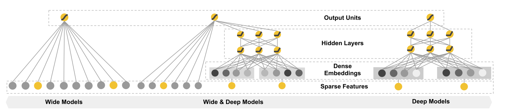
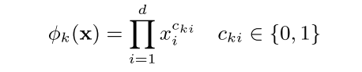
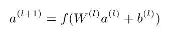
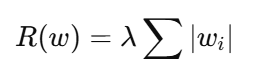
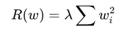

# Wide&Deep

单层的wide部分和多层的Deep部分组成的混合模型，其中wide部分主要作用是让模型具有较强的记忆能力（记忆），deep部分主要是让模型具有较强的泛化能力（扩展）

## 

形式为y=WX+b的广义线性模型

Cki是一个布尔变量，如果第i个特征是第k个变换的一部分则为1，反之为0.对于二值特征，一个组合特征当原特征都为0的时候才会0（例如“性别=女”且“语言=英语”时，AND（性别=女，语言=英语）=1，其他情况均为0）。这捕获了二元特征之间的相互作用，并为广义线性模型增加了非线性。

## Deep侧

Deep部分是一个前馈神经网络。对于分类特征，原始输入是特征串（例如，“language=en”）。这些稀疏、高维的分类特征中的每一个首先被转换成低维和密集的嵌入向量。嵌入的维数通常在O（10）到O（100）的量级。随机初始化嵌入向量，然后训练值以最小化模型训练期间的最终损失函数。这些低维密集嵌入向量然后在前向传递中被馈送到神经网络的隐藏层。具体来说，每个隐藏层执行以下计算：

## Wide&Deep联合训练

Wide & Deep模型的联合训练是通过使用小批量随机优化将梯度从输出同时反向传播到模型的Wide部分和Deep部分来完成的。在实验中，使用Followthe-regularized-leader（FTRL）算法和L1正则化作为模型Wide部分的优化器，AdaGrad 用于Deep部分。组合模型如图1（中）所示。

为什么wide部分使用FTRL+L1正则化来训练。
Wide 部分通常处理的是 **稀疏特征**，例如 one-hot 编码后的类别特征或特征交叉（cross-product）特征

###  **L1 正则化的作用**

- **稀疏性**：L1 正则化会将不重要的特征权重强制置零，从而实现特征选择。这对于稀疏特征尤为重要，可以去除无关特征，提升模型性能。
- **减小模型复杂度**：通过稀疏化权重矩阵，L1 正则化使得 Wide 部分更加高效，尤其适合特征数多但有用特征比例低的场景。

###  **FTRL 的优势**

FTRL 是一种优化算法，适合处理 **大规模稀疏特征**，并且能够高效地融合正则化（尤其是 L1）。它具有以下优点：

- FTRL 是在线学习算法，可以逐条训练数据进行权重更新，非常适合实时系统。
- 当新数据到来时，可以快速调整权重，而不需要重新训练整个模型。

- FTRL 对 L1 正则化的支持是内置的，能够在优化过程中自然地产生稀疏解。
- 它会根据特征的出现频率动态调整学习率，对稀疏特征非常友好。

L1正则化比L2正则化更容易产生稀疏解，主要与其对参数的惩罚方式有关。

- **L1正则化**惩罚项是参数的绝对值之和：

  

  这种形式导致优化问题的解倾向于让许多参数 wi精确为零。

- **L2正则化**惩罚项是参数平方的和：

  

  这种形式鼓励参数趋向于接近零，但一般不会直接变为零。

